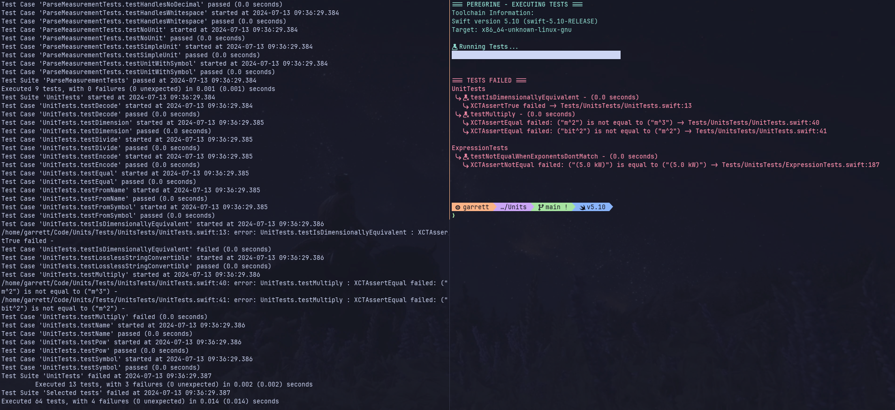

[](https://developer.apple.com/swift)
[](https://opensource.org/licenses/MPL-2.0)

# Peregrine
Peregrine is a tool for cleaning up and simplifying swift test output on the command line, to make it easier to find 
test failures, quickly. It includes things like:
- Showing only test failures and where they happened, without the output from successful tests
- Listing/Counting tests with prettier output
- Listing the longest tests by execution time in your project, including outputting the results to a csv file for tracking purposes
- Easily invoking tests with different toolchains

The screenshot below shows a side-by-side comparison of the output of `swift test` and `peregrine run`, against the excellent [Units
package](https://github.com/NeedleInAJayStack/Units):



To view all options and subcommands:
```sh
peregrine --help
```

> [!NOTE]
> peregrine is configured to output Nerd Font symbols by default. If you don't have a Nerd Font installed, you can:
> 1. [Install one!](https://www.nerdfonts.com/)
> 2. Pass the `--plain` flag to `peregrine run` for standard ascii-only output

> [!WARNING]
> peregrine does a lot of string parsing, and is heavily reliant on the output format of
> [swift-package-manager](https://github.com/apple/swift-package-manager) and `XCTest`.
> It is meant as a local development convenience tool and should be used as such. I'm sure there are bugs - contributions are welcome! See
> the "Why?" section below for more details.

## Installing
> It is assumed that you have [swift](https://www.swift.org/install/) installed, since peregrine is a tool for running swift tests.
1. Clone the repository: `git clone https://github.com/GNMoseke/peregrine.git && cd peregrine`
2. run `./install.sh` - this will build the latest version of peregrine and put it in your `/usr/local/bin`
3. If you wish to uninstall, simply run `./uninstall.sh`

## Contributing
PRs are always welcome! There is a lot of work going on in the swift testing space, including the new [swift-testing
library](https://github.com/apple/swift-testing), which looks to solve many of the same output issues that pushed me to create peregrine in
the first place.

## Known Issues
- Passing through the spm `--filter` or `--skip` flags causes the progress bar to behave unexpectedly - this is due to these flags not being
respected by `swift test list`. **Test success/failure output is unaffected, and will work with these flags.**
- If peregrine crashes (or is terminated via something other than `SIGINT`, `SIGQUIT`, or `SIGSTOP`, the shell cursor may remain hidden. Run
`tput cnorm` to fix

## Why?
peregrine was born out of my personal need for some simple things in relation to swift testing - namely:
1. Only showing failure output, since I was running a lot of large test suites and the output was incredibly noisy
2. Being able to tell me which of my tests were the slowest, so that I could take a look at improving them.

It is a tool meant for local developer convenience, as a prettified way of getting test output. Test infrastructure remains (in my opinion)
one of the weakest parts of the swift insfrastructure, though as linked above the new [swift-testing
library](https://github.com/apple/swift-testing) looks to solve many of these problems.
